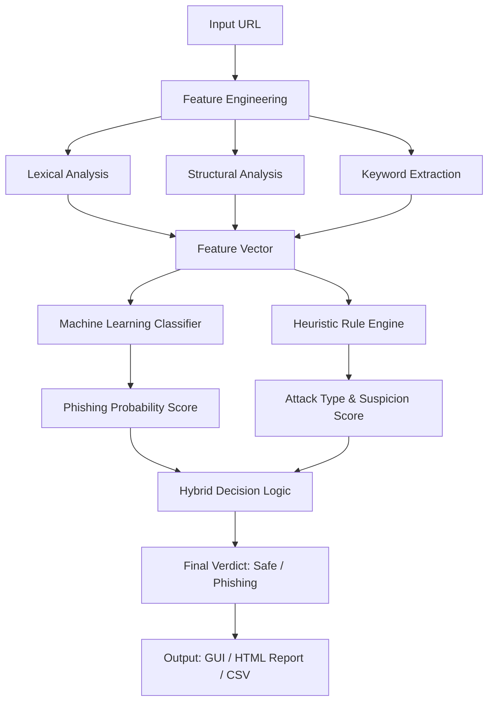

# Phishing Website Detection System using Hybrid Machine Learning

[](https://www.python.org/)
[](LICENSE)
[](https://scikit-learn.org/)
[](#)

## Project Abstract

This project implements a hybrid cybersecurity solution for identifying malicious URLs. It utilizes an integrated pipeline that combines supervised Machine Learning classifiers with a heuristic rule-based engine. The system analyzes lexical and structural URL features to predict the probability of phishing and categorize attack types. The solution includes a modular data pipeline, a graphical user interface (GUI) for real-time inference, and a batch processing tool for large-scale reporting and statistical visualization.

## System Architecture



## Technical Specializations

### AI & Machine Learning Component
The Machine Learning architecture focuses on:
*   **Supervised Learning Pipeline:** Implementation of Random Forest and XGBoost classifiers for binary classification.
*   **Feature Optimization:** Robust scaling of high-dimensional feature vectors and handling of imbalanced classes.
*   **Evaluation Metrics:** Comparative analysis using Accuracy, Precision, Recall, and F1-Score across multiple train-test splits (60/40, 70/30, 80/20).

### Phishing Detection & Domain Logic
The cybersecurity framework focuses on:
*   **Heuristic Engine:** A rule-based scoring system designed to identify brand impersonation and malicious redirection tricks.
*   **Attack Taxonomy:** Categorization of URLs into specific vectors: Credential Phishing, Financial Theft, Account Verification, Prize Scams, and Malware Distribution.
*   **Lexical Engineering:** Extraction of domain-specific indicators such as subdirectory depth, IP-based hosting, and sensitive keyword flags.

## Hybrid Decision Logic

The system utilizes a dual-layered verification process:
1.  **Probabilistic Layer:** The ML model generates a confidence score between 0 and 1 based on learned patterns from the UCI and PhishTank datasets.
2.  **Deterministic Layer:** The heuristic engine applies security rules (e.g., checking for sensitive keywords over non-HTTPS connections or IP-based hosting).
3.  **Final Synthesis:** The system aggregates both scores. High-confidence heuristic red flags can override borderline ML predictions to ensure maximum protection against zero-day phishing attempts.

## Project Structure

```text
phishing_detection/
├── data/                    # Raw and processed datasets
├── models/                  # Serialized ML models, scalers, and feature lists
├── results/                 # Batch results, CSVs, and HTML dashboards
├── step1_environment.py     # Environment configuration
├── step2_engineering.py     # URL feature extraction logic
├── step3_merge.py           # Dataset integration and labeling
├── step4_training.py        # ML training and heuristic definition
├── step5_gui.py             # Tkinter GUI implementation
├── batch_report.py          # Batch analysis and project visualization
├── requirements.txt         # Dependency specifications
└── README.md                # Technical documentation
```

## Technical Implementation

### Execution Flow
1. **Preprocessing:** Execute steps 1-3 to transform raw URL lists into a processed, feature-engineered dataset.
2. **Model Training:** Execute step 4 to generate `main_phishing_model.pkl` and the associated feature scaler.
3. **Inference:** 
    *   **GUI:** Run `step5_integrate_predict_gui.py` for real-time URL analysis.
    *   **Batch:** Run `batch_analysis_project_report.py` to process large datasets and generate HTML visual reports.

## Ethical Governance

This project is developed under the principles of **Responsible AI**. It prioritizes **Explainability (XAI)** by providing human-readable reasons for every detection. The system is designed for defensive security research, providing transparent analysis to reduce user vulnerability to social engineering.

## Development Team

*   **WASIK-S:** Phishing Detection & Domain Logic (Lead for Heuristic Engine, Feature Extraction, and Cybersecurity Framework).
*   **Salma S:** AI & Machine Learning Engineering (Lead for Model Architecture, Training Pipelines, and Evaluation).

